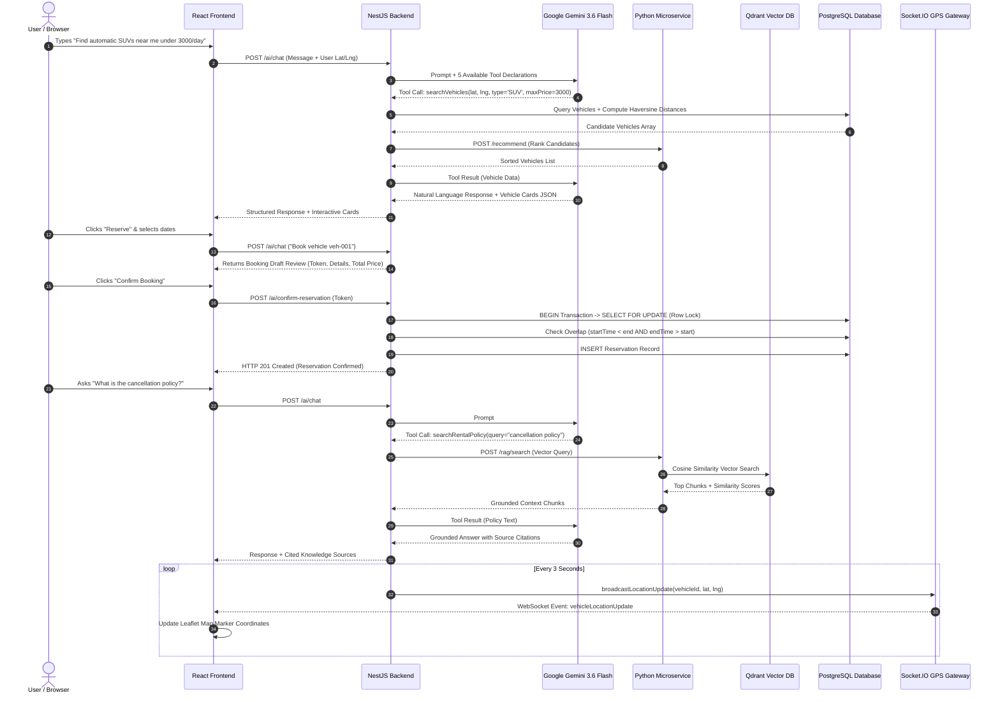

# 📘 DriveAI - Features, Architecture & Error Handling Manual

This document provides an in-depth technical explanation of all features, system data flows, error-handling mechanisms, and edge-case protections built into the **DriveAI Vehicle Rental & Sharing Platform**.

---

## 📑 Table of Contents
1. [System Architecture & Data Flow](#1-system-architecture--data-flow)
2. [Core Feature Breakdown](#2-core-feature-breakdown)
3. [Error Handling & Edge Case Protections](#3-error-handling--edge-case-protections)
4. [Step-by-Step User Workflow](#4-step-by-step-user-workflow)
5. [Verification & Auditing](#5-verification--auditing)

---

## 1. System Architecture & Data Flow



---

## 2. Core Feature Breakdown

### 🤖 Feature 1: Natural Language AI Agent & Gemini Tool Calling
- **Orchestrator**: `AiAgentService` ([ai-agent.service.ts](file:///home/developer/vechical/backend/src/ai-agent/ai-agent.service.ts))
- **Functionality**: Integrates Google Gemini 3.6 Flash using JSON Function Calling schemas.
- **Available Tools**:
  1. `searchVehicles`: Searches vehicles using radius, transmission, fuel type, seating, and maximum price.
  2. `getVehicleDetails`: Fetches full specs for a specific vehicle ID.
  3. `checkAvailability`: Verifies vehicle availability for specific start and end timestamps.
  4. `calculatePrice`: Server-side pricing calculation including GST tax and security deposit.
  5. `searchRentalPolicy`: Triggers RAG vector database search for policy questions.

### 📍 Feature 2: Vehicle Search & Haversine Distance Engine
- **Service**: `VehiclesService` ([vehicles.service.ts](file:///home/developer/vechical/backend/src/vehicles/vehicles.service.ts))
- **Distance Formula**: Uses the Haversine formula to compute exact spherical distance in kilometers between user coordinates and vehicle coordinates:
  \[
  d = 2R \arcsin \left( \sqrt{ \sin^2\left(\frac{\Delta \phi}{2}\right) + \cos(\phi_1)\cos(\phi_2)\sin^2\left(\frac{\Delta \lambda}{2}\right) } \right)
  \]
- **Filtering**: Filters candidates by user-specified radius (default 10km) and sorts results by nearest distance or ranking score.

### 💰 Feature 3: Server-Validated Dynamic Pricing Engine
- **Logic**: Prevents client-side price manipulation. All pricing is computed authoritatively on the backend server.
- **Formula**:
  \[
  \text{Total Price} = (\text{Rental Days} \times \text{PricePerDay} \times 1.18) + \text{Security Deposit}
  \]
- **Rules**: Minimum duration is 1 full 24-hour day. Durations are rounded up to whole days.

### 🔒 Feature 4: Overlap Protection & Pessimistic Row Locking
- **Service**: `ReservationsService` ([reservations.service.ts](file:///home/developer/vechical/backend/src/reservations/reservations.service.ts))
- **Concurrency Mechanism**:
  ```typescript
  return await this.prisma.$transaction(async (tx) => {
    // 1. Lock the target vehicle row to serialize concurrent booking attempts
    await tx.$queryRaw`SELECT id FROM "Vehicle" WHERE id = ${dto.vehicleId} FOR UPDATE`;
    
    // 2. Check for overlapping active reservations
    const overlap = await tx.reservation.findFirst({
      where: {
        vehicleId: dto.vehicleId,
        status: { in: ['CONFIRMED', 'PENDING'] },
        startTime: { lt: end },
        endTime: { gt: start },
      },
    });

    if (overlap) {
      throw new ConflictException('Vehicle is already reserved for the selected period');
    }

    // 3. Create confirmed reservation
    return await tx.reservation.create({ ... });
  });
  ```
- **Outcome**: Completely eliminates race conditions and double-booking even under concurrent traffic spikes.

### 📚 Feature 5: Vector RAG Policy Engine (Python + Qdrant)
- **Module**: `python-service/app/rag.py` ([rag.py](file:///home/developer/vechical/python-service/app/rag.py))
- **Embedding Model**: `sentence-transformers/all-MiniLM-L6-v2` (384-dimensional dense vectors).
- **Vector DB**: Qdrant Vector DB storing dense vectors of policy documents (Cancellation, Late Return, Insurance, Security Deposit, Fuel Policy).
- **Groundedness**: Prevents LLM hallucinations by forcing Gemini to answer policy questions using retrieved text chunks accompanied by source metadata.

### 🐍 Feature 6: Python Smart Recommendation Engine
- **Module**: `python-service/app/recommend.py`
- **Algorithm**: Scikit-Learn feature scaling and Cosine Similarity scoring based on price suitability, vehicle type preference, rating, and seating capacity.

### 📡 Feature 7: Real-time GPS Telemetry & Leaflet Maps
- **Gateway**: `TrackingGateway` ([tracking.gateway.ts](file:///home/developer/vechical/backend/src/tracking/tracking.gateway.ts))
- **Simulation**: `TrackingService` ([tracking.service.ts](file:///home/developer/vechical/backend/src/tracking/tracking.service.ts)) emits WebSocket events (`vehicleLocationUpdate`) every 3 seconds.
- **DB Checkpoint**: Saves historical GPS snapshots to the PostgreSQL `GpsLocation` table once every 5 minutes to maintain optimal DB performance.
- **Map Component**: `MapView.tsx` ([MapView.tsx](file:///home/developer/vechical/frontend/src/components/MapView.tsx)) renders OpenStreetMap markers that animate smoothly across coordinate updates.

### 💾 Feature 8: Chat History Persistence
- **Storage**: Browser `localStorage` (`driveai_chat_history_v2`).
- **Behavior**: Preserves chat messages across page refreshes. Cleared instantly when clicking the **Clear Chat** (trash icon) button.

---

## 3. Error Handling & Edge Case Protections

| Category | Potential Error / Edge Case | System Protection & Handling Strategy | HTTP Code / Result |
|---|---|---|---|
| **Concurrency** | Simultaneous booking of same vehicle at exact same second | PostgreSQL `SELECT FOR UPDATE` pessimistic row lock serializes requests. Second request is rejected. | `409 Conflict` |
| **Dates** | Reservation start date set in the past | Date validation check: `start < now`. Request rejected. | `400 Bad Request` |
| **Dates** | End date earlier than or equal to start date | Duration check: `end <= start`. Request rejected. | `400 Bad Request` |
| **Dates** | Invalid date strings passed to API | `isNaN(start.getTime())` check triggers early exit. | `400 Bad Request` |
| **GPS Bounds** | Invalid latitude/longitude values (e.g. Lat > 90) | DTO Validation Pipe (`@IsLatitude()`, `@IsLongitude()`) rejects invalid inputs. | `400 Bad Request` |
| **AI Booking** | Accidental booking without user review | 2-Phase Confirmation Flow: AI returns a draft preview token; booking only commits when user clicks "Confirm". | No DB mutation without token |
| **AI Service** | Gemini API quota limit, timeout, or network issue | NestJS catches network error, logs warning, and returns structured fallback error to client. | UI displays graceful notice |
| **Python Service** | Python microservice or Qdrant Vector DB offline | `RagService` catches HTTP error gracefully and falls back to NestJS database fallback without crashing the app. | Graceful Degrade |
| **Map Tracking** | Client disconnects WebSocket connection | `TrackingGateway` implements `OnGatewayDisconnect` to clear client subscriptions and prevent memory leaks. | Clean Socket Teardown |

---

## 4. Step-by-Step User Workflow

1. **Discovery**:
   - User opens the app at `http://localhost:5173`.
   - Selects location from the Navbar dropdown (e.g., *Indore, MP*).

2. **Natural Language Search**:
   - Navigates to **AI Assistant** tab.
   - Types: *"Find me an automatic SUV near me for tomorrow under INR 3000/day."*
   - AI Agent invokes `searchVehicles` tool, calculates Haversine distance, and displays interactive vehicle cards.

3. **Pricing & Availability Verification**:
   - User clicks **Check Availability** or **Reserve**.
   - Server validates availability and computes itemized pricing (Base + GST + Deposit).

4. **Booking Review & Confirmation**:
   - AI Agent generates a **Booking Review Draft Card**.
   - User clicks **Confirm Reservation**.
   - Backend acquires PostgreSQL row lock, verifies overlap, and commits reservation (`HTTP 201`).

5. **Policy Inquiry (RAG)**:
   - User asks: *"What happens if I cancel 24 hours before pickup?"*
   - AI Agent triggers `searchRentalPolicy`, queries Qdrant vector database via Python microservice, and returns a grounded response with source citations.

6. **Live GPS Tracking**:
   - User clicks **Track Live GPS** on **My Bookings** page.
   - Interactive OpenStreetMap opens, showing real-time Socket.IO vehicle movement pings every 3 seconds.

---

## 5. Verification & Auditing

To execute the automated end-to-end audit verifying all the above features:

```bash
# Run End-to-End Live Assessment Suite
node scripts/assessment-demo.cjs
```

Report evidence is stored automatically in [docs/assessment-evidence.json](file:///home/developer/vechical/docs/assessment-evidence.json).
